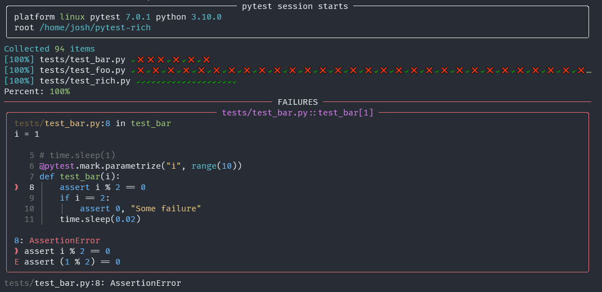

===========
pytest-rich
===========

Leverage `rich`_ for richer test session output.

This plugin is not published to PyPI yet.

.. image:: https://img.shields.io/pypi/v/pytest-rich.svg
    :target: https://pypi.org/project/pytest-rich
    :alt: PyPI version

.. image:: https://img.shields.io/pypi/pyversions/pytest-rich.svg
    :target: https://pypi.org/project/pytest-rich
    :alt: Python versions

IMPORTANT: Proof-of-concept
---------------------------

This plugin is mostly a proof of concept and is **looking for a maintainer** which wants to adopt it.

The plugin currently outputs this:

There's definitely room for improvement, and the new maintainers are free to improve on that or even change it completely.

I intend to *initially* add people as maintainers to this repository, and after a while eventually transfer it to another account.

The reason is that I played a bit with it and see promise in a full `pytest`_ + `rich`_ integration, but I don't have
the bandwidth to maintain yet another pytest plugin, so I'm opening the code to the community in the hope that someone
picks it up and gives it the treatment it deserves.

If you are interested, feel free to open an issue.

License
-------

Distributed under the terms of the `MIT`_ license, "pytest-rich" is free and open source software

----

This `pytest`_ plugin was generated with `Cookiecutter`_ along with `@hackebrot`_'s `cookiecutter-pytest-plugin`_ template.

.. _`Cookiecutter`: https://github.com/audreyr/cookiecutter
.. _`@hackebrot`: https://github.com/hackebrot
.. _`MIT`: http://opensource.org/licenses/MIT
.. _`BSD-3`: http://opensource.org/licenses/BSD-3-Clause
.. _`GNU GPL v3.0`: http://www.gnu.org/licenses/gpl-3.0.txt
.. _`Apache Software License 2.0`: http://www.apache.org/licenses/LICENSE-2.0
.. _`cookiecutter-pytest-plugin`: https://github.com/pytest-dev/cookiecutter-pytest-plugin
.. _`file an issue`: https://github.com/nicoddemus/pytest-rich/issues
.. _`pytest`: https://github.com/pytest-dev/pytest
.. _`tox`: https://tox.readthedocs.io/en/latest/
.. _`pip`: https://pypi.org/project/pip/
.. _`PyPI`: https://pypi.org/project
.. _`rich`: https://github.com/Textualize/rich
